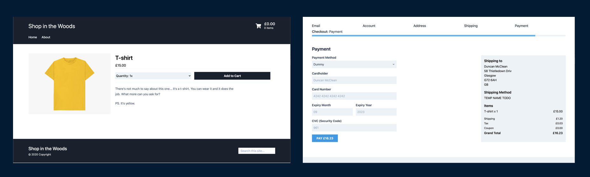

# Starter Kit for Simple Commerce


This starter kit is the recommended way of creating a new Simple Commerce store. It also demonstrates how certain features and tags are implemented inside Simple Commerce sites. This store is meant for creating new stores from **and** should be customised before it goes into a production environment.

## Features
* Minimal design
* Step-by-step checkout flow
* Built with TailwindCSS & Alpine.js
* Easy to customise

## About Simple Commerce

[Simple Commerce](https://github.com/doublethreedigital/simple-commerce) is an e-commerce addon for Statamic. It's developed by Double Three Digital, the same people behind this starter kit. It features everything a small-medium sized ecommerce store needs to function and is always being improved.

## Quick Start

1. Create site & install dependencies

```
git clone git@github.com:doublethreedigital/simple-commerce-starter.git rad-ecommerce-store
cd rad-ecommerce-store
rm -rf .git
composer install
cp .env.example .env && php artisan key:generate
```

2. Publish Simple Commerce's vendor assets. This will publish Simple Commerce's Control Panel assets and translations.

```
php artisan vendor:publish --provider="DoubleThreeDigital\SimpleCommerce\ServiceProvider"
```

3. Create your first user

```
php please make:user
```

4. Get Started!

## Build Process

This starter kit uses [Laravel Mix](https://laravel.com/docs/master/mix) to build & compile assets. Out of the box, it ships with one stylesheet and one JavaScript file.

* `resources/css/site.css` -> `public/css/site.css`
* `resources/js/site.js` -> `public/js/site.js`

There's also a few commands you can run to compile your assets for various environments.

* `npm run dev` - to compile your assets locally
* `npm run watch` - to compile your assets locally and start a watcher looking out for file changes
* `npm run production` - to compile and minify your assets, ready for production

You can of course customise this setup however you want.
